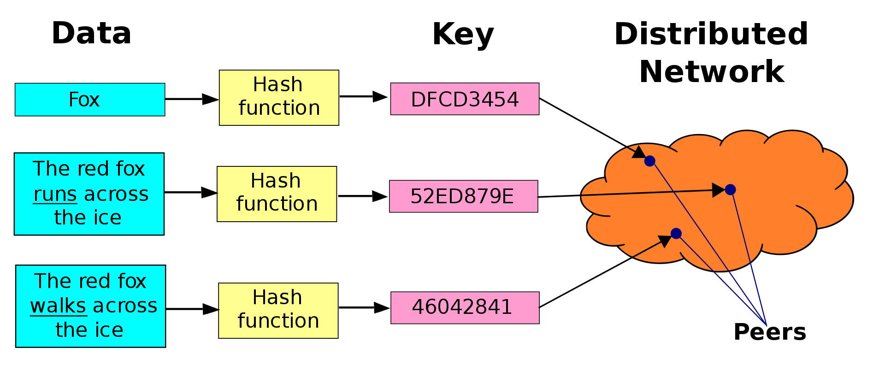

# Feature Addressable Networks

### Introdcution
Distributed hash table(DHT) is a distributed data structure that allows nodes to search for files accross a network based on key:value store.

Mostly, DHTs are used to find files and objects in decentralized networks, such as Bittorrent and IPFS. The foundation of that is cryptographic hash functions, and given the nature of crypto hashes being deterministic. If one bit changes from 0 to 1, DHTs cannot do their function. This is mostly a security feature not a bug, to insure file integrity.

The issue is, it makes it impossible to search for files that are close enough but not identical. It might be solved if search is based on discrete features rather than hash-based search. A new data model can be used by data scientists in distributed environments.
### Content addressable networks

Currently, the function of content addressable networks works as the following. Imagine there is user Alice searching for a file `movie.mkv`, in this case Alice does not have the file itself, the value.
But has the key, which it is the hash of `movie.mkv`: `SHA-1:5b4dea90924eccff9e813bada1c0e2db8321bca5`
Alice has established a connection with two other nodes, Bob and Carl. The hash is sent to them, and then each would do a lookup on their local devices to see if they have the file, if one has it, they would establish a connection with Alice to transfer the file. If not, the two nodes would relay the hash to the other nodes they are connected with, and do the same, until there is a node that has the file, and then would establish a connection with Alice to transfer the file.

The rationale behind this, is that with this gossip protocol, it would only take 32 steps to search the entire IP space of four billion. Where as if Alice would send the hash to each IP herself, it would have taken 4,294,967,296 steps.

### Using features instead of hashes
Now with hashes, it is possible to search for discrete files in a network. But not for features within the files themselves. Rather than using a class absolute checksums(hashes) as the target. Using a relative target would help with this use case.

Rather than Alice sending a hash, she would send the target for the model she has, and assuming all nodes have the same model class as well.

And instead of nodes doing a lookup locally, they would perform a loss function, if a node has a lower cost function then it received, it would send it back to Alice, if not, it would forward it to the other nodes in the network.

This way, with a few exponential steps. Alice can find the most optimal features in the network.

### Use cases
- mapping a distributed dataset based on its features
- searching for images in a decentralized network such as IPFS
- easy way to increase the size of a training dataset by searching for similar features